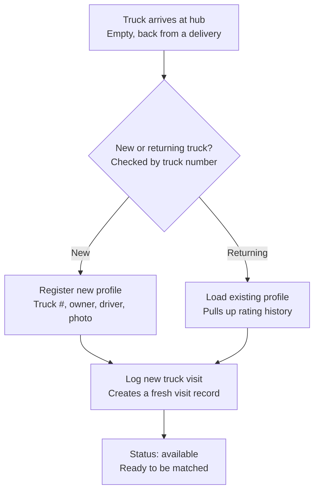
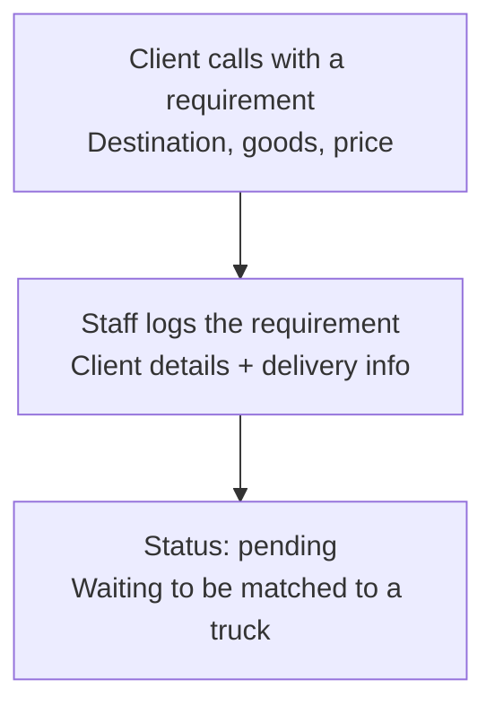
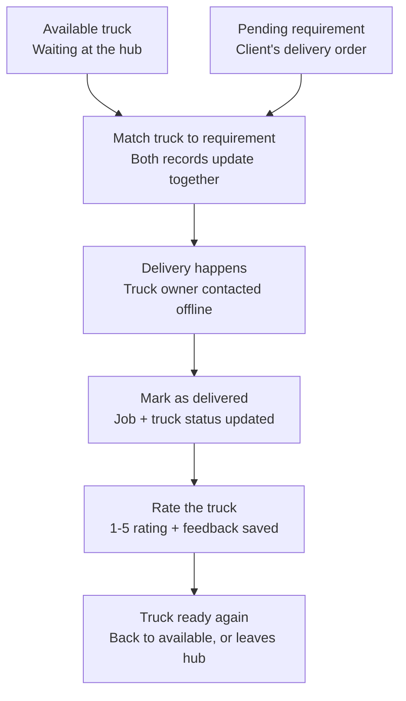
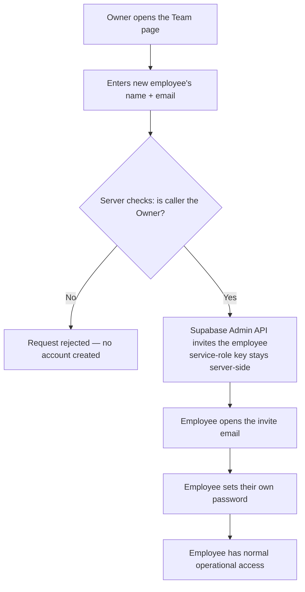
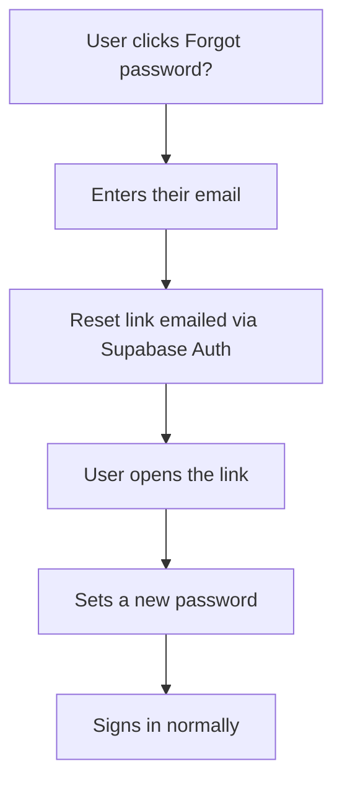
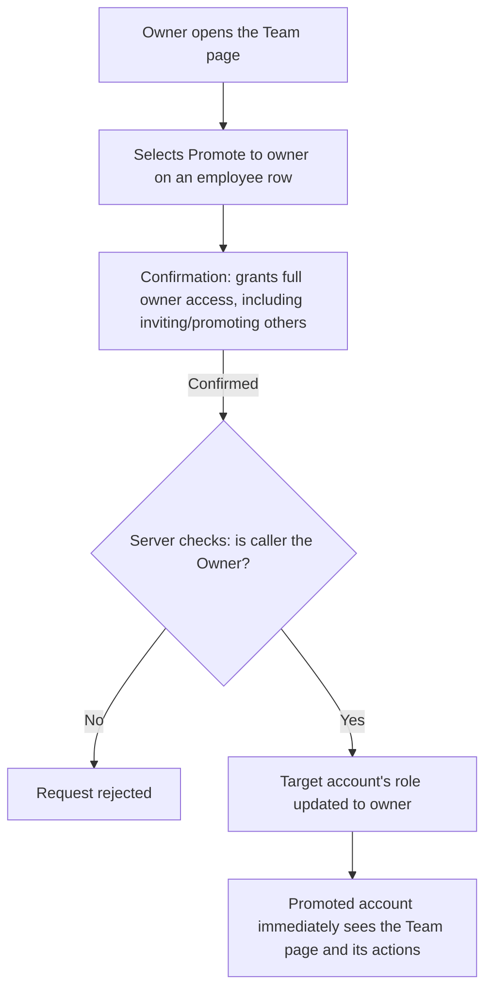

# User Flows (Final)

Companion to `PRD-TransportHub.md` and `BACKLOG-TransportHub.md`. Renders natively in GitHub and Azure Repos markdown previews.

## 1. Truck Arrival

A visit logged by mistake can be deleted individually from the truck's profile (with confirmation) without deleting the truck — the truck's status then safely falls back to its next most recent visit, or to "no visits yet" if none remain.

## 2. Requirement Intake

## 3. Matching, Delivery & Rating

## 4. Owner Invites an Employee

This is the only way a new account can be created — public self-signup is disabled at both the login screen and the API level.

## 5. Forgot Password

## 6. Promote an Employee to Owner

Flow 3's last step loops conceptually back into Flow 1 — a truck can return to the hub weeks later and re-enter as a "returning truck," which is why rating and visit history persist on its permanent profile rather than resetting each time.
